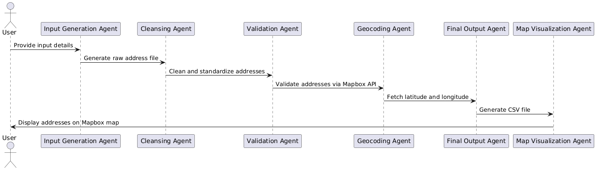

= AI Agentic App - Method Specification
:toc:

== Agent Workflow

The system consists of multiple autonomous agents that collaborate:

* **Input Generation Agent** - Interacts with the user to generate an initial file of raw addresses.
* **Cleansing Agent** - Standardizes and cleans the raw addresses.
* **Validation Agent** - Validates addresses using the Mapbox API.
* **Geocoding Agent** - Fetches latitude and longitude for validated addresses.
* **Final Output Agent** - Generates a CSV file containing original, cleansed, and geocoded addresses.
* **Map Visualization Agent** - Uses Mapbox APIs to plot the geocoded addresses onto a street view map.

== LangChain Integration

Agents are implemented using LangChain framework:
- Each agent executes tasks independently while retaining shared memory.
- Agents can query the Mapbox API when needed.
- Logs errors and status updates at each step.

== Logging Implementation

Logging captures critical steps:
- User inputs and generated raw addresses.
- Address cleansing transformations applied.
- API validation results (success/failure logs).
- Geolocation API responses.
- Final output file generation status.

== UML Diagram

The workflow of the agentic system is represented below:

